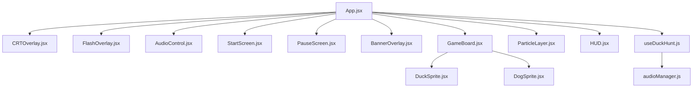

# 🦆 Duck Hunt — Retro Arcade Edition (React)

[](https://reactjs.org/)
[](https://vitejs.dev/)
[](https://developer.mozilla.org/en-US/docs/Web/JavaScript)
[](https://developer.mozilla.org/en-US/docs/Web/CSS)
[](#-technical-architecture)
[](LICENSE)

An authentic, modern recreation of the legendary 1984 NES classic **Duck Hunt**, re-engineered from the ground up as a high-performance **React** single-page web application powered by **Vite** and hardware-accelerated **Vanilla CSS**.

Relive the golden age of 8-bit lightgun arcade shooting in any modern browser — supercharged with a comprehensive **Vintage & Modern Retro Animation Suite**, including authentic CRT phosphor scanlines, muzzle blast sparks, lightgun screen recoil, floating 8-bit score indicators, drifting feather physics, and multi-channel sound pooling.

---

## 📑 Table of Contents

- [✨ Key Features](#-key-features)
  - [📺 Vintage Arcade CRT Aesthetics](#-vintage-arcade-crt-aesthetics)
  - [💥 Modern Retro Tactile "Juice"](#-modern-retro-tactile-juice)
  - [🕹️ Classic NES Game Mechanics](#️-classic-nes-game-mechanics)
- [🎮 Controls](#-controls)
- [🏆 Scoring & Rules](#-scoring--rules)
- [🏗️ Technical Architecture](#️-technical-architecture)
  - [Component Breakdown](#component-breakdown)
  - [60 FPS Game Engine (`useDuckHunt`)](#60-fps-game-engine-useduckhunt)
  - [Polyphonic Audio Manager](#polyphonic-audio-manager)
- [📁 Project Structure](#-project-structure)
- [🚀 Getting Started](#-getting-started)
  - [Prerequisites](#prerequisites)
  - [Installation](#installation)
  - [Development & Production](#development--production)
- [⚙️ Customization & Game Tuning](#️-customization--game-tuning)
- [🌐 Deployment](#-deployment)
- [📜 License & Acknowledgments](#-license--acknowledgments)

---

## ✨ Key Features

### 📺 Vintage Arcade CRT Aesthetics
- **Authentic Phosphor Scanlines**: Precision horizontal CRT raster lines with subtle high-voltage flicker.
- **Vignette & Tube Curvature**: Radial corner darkening simulating retro curved cathode-ray glass monitors.
- **Instant CRT Toggle**: Seamlessly toggle between vintage arcade monitor mode and ultra-crisp modern HD at any time via the top header button (`📺 CRT: ON / OFF`), persisted in `localStorage`.

### 💥 Modern Retro Tactile "Juice"
- **Gun Recoil Screen Shake**: Dynamic kickback vibration on every trigger pull for punchy, tactile feedback.
- **Muzzle Blast & Sparks**: Radiant particle sparks burst outward from the exact reticle impact point upon firing.
- **Floating Arcade Score (`+500`)**: Hitting a duck immediately pops up a glowing, rising 8-bit score badge that springs upward before fading out.
- **Drifting Feather Particles**: Realistic feather sprites scatter, flutter, and drift dynamically when a duck is hit.
- **Miss Click Shockwaves**: Firing into empty sky or terrain produces an expanding ricochet shockwave ring.
- **Lightgun Flash Overlay**: Simulates the authentic white screen flash used by the original NES Zapper lightgun sensor.

### 🕹️ Classic NES Game Mechanics
- **10 Ducks Per Round**: Progressive waves of 1 or 2 ducks based on round quota.
- **3 Bullets Per Wave**: Every shot counts — missing shots or letting the 7-second timer expire triggers the ducks to fly away!
- **Dynamic Speed Escalation**: Duck velocities and flight patterns increase with every round.
- **Passing Requirement**: Bag at least **6 out of 10 ducks** to qualify for the next round.
- **The Infamous Dog**:
  - The hound rises from the tall grass to proudly hoist 1 or 2 retrieved ducks with a victory jingle.
  - Miss all ducks in a wave? The dog pops up and delivers his iconic mocking laugh!
- **Authentic NES Retro HUD**:
  - Ammo chamber with active bullet shells and recoil indicators.
  - 10-indicator hit tracker with blinking active duck slot and vivid neon hit pulses.
  - Digital score, round counter, and all-time top score tracker.
- **Persistent High Scores**:
  - Top scores are automatically stored and retrieved from the browser's `localStorage`.
- **Keyboard Shortcuts & Pause**:
  - Press `[ESC]` at any moment during gameplay to pause the hunt.

---

## 🎮 Controls

| Action | Input Control | Description |
| :--- | :--- | :--- |
| **Shoot / Pull Trigger** | **Left Mouse Click** | Fires the lightgun at the cursor position |
| **Pause / Resume Game** | **`[ESC]` Key** | Freezes the game loop and displays pause modal |
| **Toggle CRT Monitor Mode**| **`📺 CRT` Button** | Toggles vintage scanlines & curved CRT vignette |
| **Toggle Sound Effects** | **`🔊 SOUND` Button** | Mutes or unmutes all sound effects |
| **Start / Restart Game** | **Click Start / `Enter` / `Space`** | Begins round 1 or restarts after Game Over |

---

## 🏆 Scoring & Rules

| Event | Points Awarded | Condition |
| :--- | :---: | :--- |
| **Duck Shot Down** | **+500 pts** | Click registered inside duck hitbox |
| **Round Advance** | — | Hit **≥ 6 / 10** ducks in the round |
| **Game Over** | — | Hit **< 6 / 10** ducks at round end |
| **High Score** | — | Automatically saved to `localStorage` |

---

## 🏗️ Technical Architecture

### Component Breakdown



### 60 FPS Game Engine (`useDuckHunt`)
- **`requestAnimationFrame` Physics Loop**: Computes smooth 60+ FPS duck trajectory updates, boundary collisions, wall bounces, and gravity-assisted falls.
- **Deterministic State Machine**: Manages transitions between `START_SCREEN`, `WAVE_START`, `PLAYING`, `WAVE_CLEAR`, `DOG_ANIMATION`, `ROUND_CLEAR`, `GAME_OVER`, and `PAUSED`.
- **Adaptive Window Sizing**: Dynamically recalculates playfield boundaries on window resize events to ensure ducks bounce properly on all display resolutions.
- **Hardware-Accelerated CSS Particles**: Sparks, floating scores, feathers, and shockwaves utilize CSS transforms and opacity transitions for smooth GPU rendering without degrading game physics.

### Polyphonic Audio Manager
- **Zero-Latency Audio Pooling**: Reusable Web Audio elements preloaded on app boot (`audioManager.js`).
- **Concurrent Sound Channels**: Clones audio buffers to allow rapid-fire gunshots to overlap without cutting off wing flapping, quacks, or jingles.
- **Global Mute Sync**: Single reactive source of truth for all game audio events.

---

## 📁 Project Structure

```text
Duck-Hunt/
├── public/                     # Static game assets
│   ├── dog-duck1.png           # Dog holding 1 retrieved duck
│   ├── dog-duck2.png           # Dog holding 2 retrieved ducks
│   ├── dog-score.mp3           # Round clear / victory fanfare
│   ├── duck-flap.mp3           # Wing flapping sound effect
│   ├── duck-left.gif           # Left flying duck sprite animation
│   ├── duck-quack.mp3          # Quack sound effect
│   ├── duck-right.gif          # Right flying duck sprite animation
│   ├── duck-shot.mp3           # Authentic gunshot sound effect
│   ├── duckhunt-bg-4k.png      # 4K remastered NES meadow background
│   ├── game-font.otf           # 8-bit arcade typography
│   └── target.png              # Custom crosshair cursor
├── src/
│   ├── components/             # Modular React UI components
│   │   ├── AudioControl.jsx    # Audio mute toggle button
│   │   ├── BannerOverlay.jsx   # Chromatic aberration glitch text banner
│   │   ├── CRTOverlay.jsx      # Phosphor scanlines, vignette & CRT toggle
│   │   ├── DogSprite.jsx       # Dog grass rise & duck retrieve animation
│   │   ├── DuckSprite.jsx      # Flying, shot, and falling duck sprite
│   │   ├── FlashOverlay.jsx    # Lightgun CRT white flash simulation
│   │   ├── GameBoard.jsx       # Interactive playfield & impact detector
│   │   ├── HUD.jsx             # Shell-ejecting ammo, hit tracker & score
│   │   ├── ParticleLayer.jsx   # Sparks, shockwaves, floating score & feathers
│   │   ├── PauseScreen.jsx     # Pause modal overlay
│   │   └── StartScreen.jsx     # Arcade title & high score overlay
│   ├── hooks/
│   │   └── useDuckHunt.js      # 60 FPS physics engine, recoil & effect state
│   ├── utils/
│   │   └── audioManager.js     # Multi-channel sound preloading & playback
│   ├── App.jsx                 # Main application coordinator
│   ├── main.jsx                # React DOM entrypoint
│   └── index.css               # Arcade styling, CRT FX & animations
├── index.html                  # HTML entry template
├── package.json                # Project dependencies and scripts
├── vite.config.js              # Vite React configuration
└── README.md                   # Project documentation
```

---

## 🚀 Getting Started

### Prerequisites
- [Node.js](https://nodejs.org/) (version 18.x or 20.x+ recommended)
- `npm`, `pnpm`, or `yarn`

### Installation

1. **Clone the repository**:
   ```bash
   git clone https://github.com/Mr-Prince2/duck-hunt.git
   cd duck-hunt
   ```

2. **Install dependencies**:
   ```bash
   npm install
   ```

### Development & Production

- **Start local development server**:
  ```bash
  npm run dev
  ```
  Open your browser and navigate to `http://localhost:3000` (or the URL shown in your terminal).

- **Build optimized production bundle**:
  ```bash
  npm run build
  ```
  Generates production-ready static assets in the `dist/` folder.

- **Preview the production build locally**:
  ```bash
  npm run preview
  ```

---

## ⚙️ Customization & Game Tuning

All primary gameplay balance variables are cleanly exposed in [`src/hooks/useDuckHunt.js`](src/hooks/useDuckHunt.js):

```javascript
// Gameplay constants in src/hooks/useDuckHunt.js
export const DUCK_WIDTH = 96;           // Duck hitbox width (px)
export const DUCK_HEIGHT = 93;          // Duck hitbox height (px)
export const DUCKS_PER_ROUND = 10;      // Number of ducks per round
export const PASSING_HITS_REQUIRED = 6; // Ducks required to advance
const FLYAWAY_SPEED = -10;              // Upward speed when duck escapes
const WAVE_DURATION = 7000;             // Time limit per wave (ms)
```

To modify duck flight velocity scaling, locate `spawnDucks` inside `useDuckHunt.js`:
```javascript
const baseSpeed = 4 + round * 0.75; // Adjust speed increase per round
```

---

## 🌐 Deployment

The project builds to standard static HTML, CSS, and JS files, making it deployable anywhere:

### Deploy to GitHub Pages
1. In `vite.config.js`, set `base: '/duck-hunt/'` (matching your repo name).
2. Run `npm run build`.
3. Push the contents of `dist/` to your `gh-pages` branch.

### Deploy to Vercel / Netlify
1. Connect your GitHub repository to [Vercel](https://vercel.com) or [Netlify](https://netlify.com).
2. Set the build command to `npm run build`.
3. Set the output directory to `dist`.
4. Deploy!

---

## 📜 License & Acknowledgments

- This project is released under the **MIT License**.
- Built with ❤️ as an homage to the legendary 1984 Nintendo classic *Duck Hunt*.
- Original sound effects and artwork concepts are property of Nintendo.
