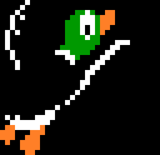
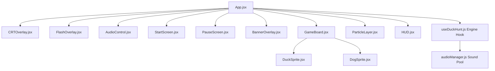

<div align="center">

  

  # Duck Hunt: Retro Arcade Edition

  **A high-fidelity, 60+ FPS modern browser recreation of Nintendo's iconic 1984 NES classic.**

  [](https://reactjs.org/)
  [](https://vitejs.dev/)
  [](https://developer.mozilla.org/)
  [](https://developer.mozilla.org/en-US/docs/Web/CSS)
  [](#-technical-architecture)
  [](LICENSE)

  <p>
    <a href="#-key-features">Features</a> •
    <a href="#-gameplay--controls">Controls</a> •
    <a href="#-technical-architecture">Architecture</a> •
    <a href="#-quick-start">Quick Start</a> •
    <a href="#-configuration--game-tuning">Configuration</a> •
    <a href="#-deployment">Deployment</a>
  </p>

</div>

---

> [!NOTE]
> **Duck Hunt: Retro Arcade Edition** brings the authentic 8-bit lightgun arcade experience to modern desktop and mobile browsers. Engineered with React 18, Vite, and hardware-accelerated CSS animations, it pairs vintage authenticity (CRT phosphor scanlines, dog cutscenes, NES HUD) with modern game-feel "juice" (screen recoil, muzzle sparks, floating score indicators, and polyphonic audio).

---

## 📸 Feature Comparison: 1984 NES vs. Remaster

| Feature | Original NES (1984) | Retro Arcade Remaster (2026) |
| :--- | :---: | :---: |
| **Display Mode** | CRT Monitor Only | Switchable CRT Emulation & Crisp Modern HD |
| **Feedback / VFX** | Static hit flash | Recoil Screen Shake, Spark Bursts, Feather Physics |
| **Score Visuals** | Static HUD update | Animated Floating Score Badges (`+500`) |
| **Audio Engine** | 2A03 APU Sound Chip | Web Audio API with Zero-Latency Polyphonic Pooling |
| **Resolution** | 256 × 240 (Fixed) | Responsive Dynamic Playfield (Up to 4K Ultra-Wide) |
| **Save State** | Volatile (Lost on power off) | Persistent Top Scores via `localStorage` |

---

## ✨ Key Features

### 📺 Vintage Arcade CRT Emulation
* **Authentic Phosphor Raster**: Fine horizontal CRT raster scanlines with high-voltage phosphor glow.
* **Curved Tube Vignette**: Soft radial darkening simulating 80s arcade cathode-ray tube glass curvature.
* **Instant Toggle**: Switch between nostalgic arcade tube emulation and crystal-clear modern visuals anytime via `📺 CRT: ON / OFF`. Preference is automatically saved in `localStorage`.

### 💥 Modern Retro Tactile "Juice"
* **Lightgun Recoil Screen Shake**: Visceral screen kickback on every trigger pull for punchy tactile feedback.
* **Muzzle Blast & Sparks**: Radiant particle sparks blast outward from the exact crosshair point of impact.
* **Floating Arcade Scores (`+500`)**: Hitting a target spawns a dynamic rising 8-bit score counter.
* **Dynamic Feather Scattering**: Downed ducks release drifting feathers that flutter downward with simulated drag.
* **Muzzle Flash**: Authentic lightgun white-frame sensor flash on shot registration.
* **Miss-Click Shockwaves**: Firing into empty terrain triggers expanding ricochet shockwaves.

### 📱 Mobile & Tablet Landscape Optimization
* **Dedicated Arcade Landscape View**: Automatically detects mobile/tablet devices in portrait mode and displays an arcade orientation prompt to guide users into landscape.
* **Native Fullscreen Toggle (`⛶ FULL`)**: Fullscreen toggle in the top bar to maximize vertical space and eliminate browser URL bar encroachment.
* **Zero-Latency Touch & Pointer Events**: Direct `onPointerDown` handling eliminates 300ms mobile touch delay; gestures are prevented with `touch-action: none`.
* **Adaptive Duck & HUD Scaling**: Responsive hitbox scaling (`70×68px` on mobile landscape vs. `96×93px` on desktop) and compact HUD with notch safe-area insets (`env(safe-area-inset-*)`).
* **Coarse Finger Hitbox Expansion**: Invisible touch padding ensures responsive tapping on ducks using mobile fingers.

### 🕹️ Complete NES Game Loop
* **10 Ducks Per Round**: Progressive waves of 1 or 2 ducks based on round quota.
* **3 Shells Per Wave**: Shot management matters — running out of ammo or letting the 7-second timer lapse triggers a flyaway.
* **Speed Escalation**: Duck flight speed and trajectory complexity increase with each round.
* **Passing Requirement**: Land at least **6 out of 10 ducks** to qualify for the next round.
* **The Hound's Reactions**:
  * Success: The dog rises from the tall grass proudly presenting retrieved ducks accompanied by victory fanfares.
  * Failure: Miss both ducks and endure the infamous mocking laugh.
* **Authentic NES HUD**:
  * Ammo chamber displaying remaining bullet shells with firing animations.
  * 10-slot hit tracker featuring active blinking target slots and neon hit indicators.
  * Real-time score, current round counter, and all-time top score display.
* **Interactive Pause State**: Press `[ESC]` at any point to pause/resume the game loop.

---

## 🎮 Gameplay & Controls

<div align="center">

| Action | Input Control | Description |
| :--- | :---: | :--- |
| **Shoot / Pull Trigger** | `Left Click` / `Touch Tap` | Discharges lightgun at cursor or finger tap position |
| **Fullscreen Mode** | `⛶ FULL` Button | Enters or exits native browser fullscreen view |
| **Pause / Resume** | `[ESC]` Key | Freezes physics loop and displays pause modal |
| **Toggle CRT Filter** | `📺 CRT` Button | Toggles scanlines and vignette display pipeline |
| **Toggle Sound** | `🔊 SOUND` Button | Mutes or unmutes master audio channels |
| **Start / Restart Game** | `Tap` / `Click` / `Space` / `Enter` | Initializes Round 1 or restarts after Game Over |

</div>

### 🏆 Scoring Rules
* **Target Downed**: `+500 points`
* **Round Advancement Threshold**: `≥ 6 / 10 hits`
* **Game Over Condition**: `< 6 / 10 hits`
* **Top Score**: Automatically written to `localStorage` upon round completion or Game Over.

---

## 🏗️ Technical Architecture

### Component Hierarchy



### Core Modules

1. **`useDuckHunt.js` (Deterministic Game & Physics Engine)**:
   - Orchestrates the 60 FPS animation loop via `requestAnimationFrame`.
   - Manages state transitions: `START_SCREEN` ➔ `WAVE_START` ➔ `PLAYING` ➔ `WAVE_CLEAR` ➔ `DOG_ANIMATION` ➔ `ROUND_CLEAR` ➔ `GAME_OVER` ➔ `PAUSED`.
   - Performs continuous bounding-box collision detection with real-time viewport boundary reflection.
   - Controls wave countdown timers and velocity escalation curves ($v = 4 + \text{round} \times 0.75$).

2. **`audioManager.js` (Polyphonic Audio Pool)**:
   - Pre-caches all sound assets upon initialization to eliminate runtime decode latency.
   - Spawns independent audio node clones on demand, allowing rapid overlapping gunshots without clipping wing flaps, quacks, or jingles.
   - Master volume and mute state synchronized across all channels.

3. **`ParticleLayer.jsx` (Hardware-Accelerated VFX)**:
   - Utilizes CSS transform matrix and opacity transitions (`translate3d`, `will-change`) for 0-repaint visual effects.
   - Auto-cleans expired particle objects from state to prevent memory leaks during extended play sessions.

---

## 📁 Project Structure

```text
Duck-Hunt/
├── public/                     # Static game assets & audio
│   ├── dog-duck1.png           # Dog holding 1 retrieved duck
│   ├── dog-duck2.png           # Dog holding 2 retrieved ducks
│   ├── dog-score.mp3           # Victory fanfare jingle
│   ├── duck-flap.mp3           # Flapping wings audio clip
│   ├── duck-left.gif           # Flying duck sprite animation (Left)
│   ├── duck-right.gif          # Flying duck sprite animation (Right)
│   ├── duck-quack.mp3          # Duck quack audio clip
│   ├── duck-shot.mp3           # Lightgun gunshot sound effect
│   ├── duckhunt-bg-4k.png      # 4K remastered NES meadow backdrop
│   ├── game-font.otf           # 8-bit arcade typography font
│   └── target.png              # Custom lightgun crosshair cursor
├── src/
│   ├── components/             # Reusable UI & game components
│   │   ├── AudioControl.jsx    # Sound mute toggle header button
│   │   ├── BannerOverlay.jsx   # Chromatic aberration round banner
│   │   ├── CRTOverlay.jsx      # Scanlines, vignette & CRT toggle
│   │   ├── DogSprite.jsx       # Animated retriever dog component
│   │   ├── DuckSprite.jsx      # Animated duck component (flight/fall)
│   │   ├── FlashOverlay.jsx    # White lightgun sensor flash
│   │   ├── FullscreenControl.jsx # Native browser fullscreen toggle
│   │   ├── GameBoard.jsx       # Interactive playfield & pointer handler
│   │   ├── HUD.jsx             # NES HUD (ammo, hit track, scores)
│   │   ├── ParticleLayer.jsx   # Sparks, feathers & floating score tags
│   │   ├── PauseScreen.jsx     # Pause modal overlay
│   │   ├── RotatePrompt.jsx    # Mobile portrait orientation guide
│   │   └── StartScreen.jsx     # Retro title screen & controls overview
│   ├── hooks/
│   │   └── useDuckHunt.js      # Physics engine & game state machine
│   ├── utils/
│   │   └── audioManager.js     # Sound pool & preloader manager
│   ├── App.jsx                 # Application layout coordinator
│   ├── main.jsx                # React DOM root entrypoint
│   └── index.css               # Arcade styling, CRT FX & keyframe anims
├── index.html                  # HTML entrypoint
├── package.json                # Project dependencies and npm scripts
├── vite.config.js              # Vite build configuration
└── README.md                   # Repository documentation
```

---

## 🚀 Quick Start

### Prerequisites
* [Node.js](https://nodejs.org/) (version `18.x` or `20.x+` recommended)
* `npm`, `pnpm`, or `yarn`

### Installation

```bash
# 1. Clone the repository
git clone https://github.com/Mr-Prince2/duck-hunt.git

# 2. Navigate to project root
cd duck-hunt

# 3. Install dependencies
npm install
```

### Running Locally

```bash
# Start the Vite development server with Hot Module Replacement (HMR)
npm run dev
```

Visit `http://localhost:3000` (or the address printed in your terminal) in your browser.

### Production Build

```bash
# Compile and minify for production
npm run build

# Preview the production build locally
npm run preview
```

---

## ⚙️ Configuration & Game Tuning

All primary game constants are defined cleanly in [`src/hooks/useDuckHunt.js`](src/hooks/useDuckHunt.js) for effortless game balancing:

```javascript
// Game Balance Constants (src/hooks/useDuckHunt.js)
export const DUCK_WIDTH = 96;           // Target hitbox width in pixels
export const DUCK_HEIGHT = 93;          // Target hitbox height in pixels
export const DUCKS_PER_ROUND = 10;      // Total ducks per round
export const PASSING_HITS_REQUIRED = 6; // Minimum hits to advance round
const FLYAWAY_SPEED = -10;              // Escape ascent speed (px/frame)
const WAVE_DURATION = 7000;             // Time limit per wave in ms (7 seconds)
```

To modify duck velocity progression:
```javascript
// Base speed formula inside spawnDucks()
const baseSpeed = 4 + round * 0.75;
```

---

## 🌐 Deployment

This application produces a completely self-contained static build within the `dist/` directory, compatible with any static hosting provider.

### Vercel / Netlify
1. Connect your GitHub repository to [Vercel](https://vercel.com) or [Netlify](https://netlify.com).
2. Set the build command to `npm run build`.
3. Set the output directory to `dist`.
4. Deploy!

### GitHub Pages
1. Open [`vite.config.js`](vite.config.js) and add the repository base URL:
   ```javascript
   export default defineConfig({
     base: '/duck-hunt/',
     plugins: [react()]
   });
   ```
2. Build the project: `npm run build`
3. Deploy the `dist` directory to your repository's `gh-pages` branch.

---

## 🤝 Contributing

Contributions, issues, and feature requests are welcome!

1. Fork the project
2. Create your feature branch (`git checkout -b feature/AmazingFeature`)
3. Commit your changes (`git commit -m 'feat: add AmazingFeature'`)
4. Push to the branch (`git push origin feature/AmazingFeature`)
5. Open a Pull Request

---

## 📜 License & Legal Attribution

* **Software License**: Distributed under the [MIT License](LICENSE).
* **Attribution**: *Duck Hunt* was originally created and published by **Nintendo** in 1984. All original sprite concepts, sound effects, and game motifs are tributes to the original work. This project was developed independently for educational and archival purposes.
